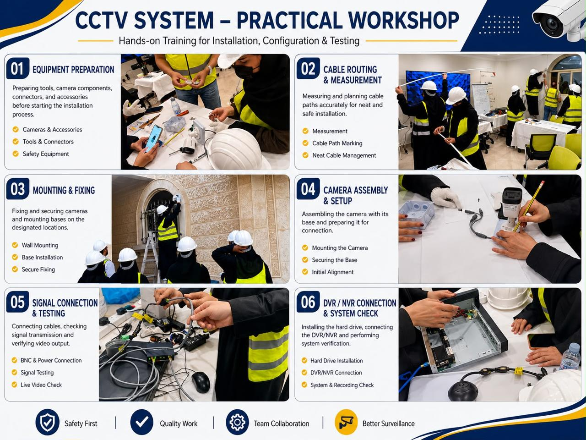
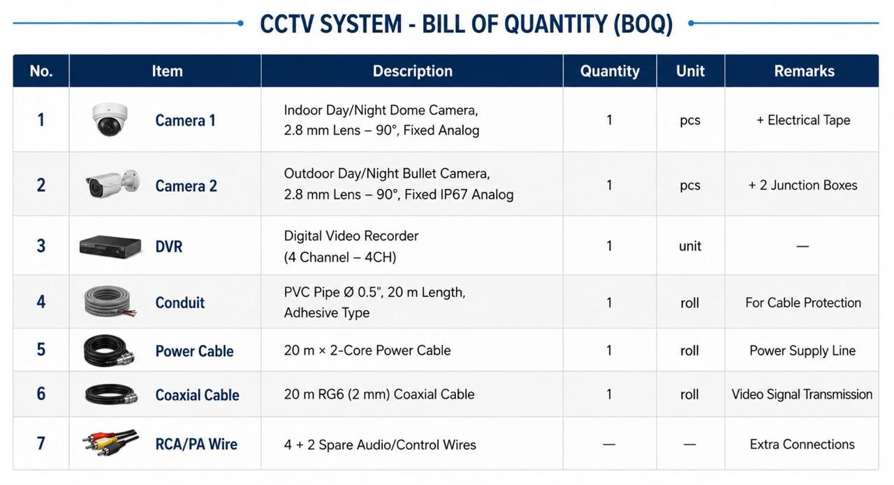

# AI-Powered CCTV Monitoring System

**Project Lead:** Afnan Saleh Alroaished

## Overview

This project presents a complete CCTV surveillance system assessment and practical implementation completed during professional CCTV systems training.

My responsibilities included leading the project, preparing the technical assessment report, documenting the installation process, creating the Bill of Quantity (BOQ), evaluating system components, and providing engineering recommendations.

---

# Practical Workshop

Hands-on installation and configuration including:

- Camera Installation
- Cable Routing
- DVR Configuration
- System Testing
- Equipment Preparation
- Technical Documentation

---

# Bill of Quantity (BOQ)

The BOQ contains all required CCTV components including cameras, DVR, cabling, conduit, accessories, and installation materials.

---

# Technical Report

📄 **Assessment Report**

[CCTV Surveillance System Assessment Report](CCTV_Surveillance_System_Assessment_Report.pdf)

---

# Technologies

- CCTV Systems
- Analog Cameras
- DVR
- Networking
- Technical Documentation
- Bill of Quantity (BOQ)
- System Assessment

---

# Skills Demonstrated

- CCTV Installation
- Technical Documentation
- System Assessment
- BOQ Preparation
- Troubleshooting
- Team Leadership
- Project Coordination

---

# Project Status

**Completed Successfully**

---

## Author

**Afnan Saleh Alroaished**
